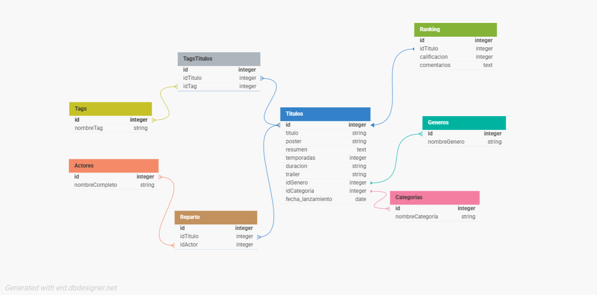

# Trailerflix
## Entrega Final
### Grupo 13
------
- [Integrantes](#integrantes)
- [Para Iniciar Servidor](#para-iniciar-servidor)
- [Dependencias](#dependencias)
- [Archivo .env](#archivo-env)
- [Peticiones](#peticiones)
    - [Titulos](#titulos)
        - [Listado de Titulos](#listado-de-titulos)
        - [Busqueda de Titulo](#busqueda-de-titulo)
        - [Busqueda de Reparto por Titulo](#busqueda-de-reparto-por-titulo)
        - [Busqueda por Categoria](#busqueda-de-titulos-por-categoria)
        - [Busqueda de Titulo por Resumen](#busqueda-de-titulos-por-resumen)
        - [Cantidad de Series y Peliculas](#cantidad-de-series-y-peliculas)
        - [Listado de Series por Temporada](#listado-de-series-por-cantidad-de-temporadas)
    - [Generos](#generos)
        - [Listado de Generos](#listado-de-generos)
        - [Busqueda de Titulos por Genero](#busqueda-de-titulos-por-genero)
    - [Actores](#actores)
        - [Listado de Actores](#listado-de-actores)
        - [Busqueda de Actor](#listado-de-actores)
        - [Busqueda de Actor por Nombre](#busqueda-de-actor-por-nombre)
        - [Busqueda de Titulos por Actor](#busqueda-de-titulos-por-actor)
    - [Tags](#tags)
        - [Listado de Tags](#listado-de-tags)
        - [Busqueda de Titulos por Tag](#busqueda-de-titulos-por-tag)
        - [Busqueda de Tags por Titulo](#busqueda-de-tags-por-titulo)
    - [Ranking](#ranking)
        - [Listado de Ranking](#listado-de-ranking)
        - [Busqueda de Rankings por Titulo](#busqueda-de-rankings-por-titulo)

------
#### Integrantes
* Sofia D'Ascanio
* Yanina Anahí Mylek
* María de los Ángeles Rechach

#### Para Iniciar Servidor

* ` cd trailerflix `
* ` npm start `

#### Dependencias

* ` npm install dotenv` 
* ` npm install --save sequelize `
* ` npm install --save mysql2`

#### Archivo `.env`
Necesario para la conexión a la Base de Datos.
```javascript
PORT= Puerto para usar
DB_HOST= Host
DB_NAME= Nombre de la Base de Datos
DB_USER= Nombre de Usuario de MySQL
DB_PASS= Contraseña de MySQL
```
-----------
## Modelo Trailerflix


---------
## Peticiones
| PETICIÓN | URL | DESCRIPCIÓN |
|:--------:|-----|-------------|
| GET | [/titulos](./trailerflix/src/routes/titulos/getAll.js) | Catalogo de **Trailerflix** |
| GET | [/titulos/:id](./trailerflix/src/routes/titulos/getById.js) | Busqueda de **titulo** por *id* |
| GET | [/titulos/reparto/:id](./trailerflix/src/routes/titulos/getReparto.js) | Busqueda de reparto de un **titulo** por *id* |
| GET | [/titulos/categoria/:categoria](./trailerflix/src/routes/titulos/getAllSeries.js) | Busqueda de titulos por **Categoria** |
| GET | [/titulos/resumen/:palabra](./trailerflix/src/routes/titulos/getAllPeliculas.js) | Listado de titulos cuyo resumen incluya la palabra *:palabra*|
| GET | [/titulos/cantidad](./trailerflix/src/routes/titulos/getAllPeliculas.js) | Cantidad de **Series** y **Peliculas** en Trailerflix |
| GET | [/titulos/series/:temporadas](./trailerflix/src/routes/titulos/getAllPeliculas.js) | Listado de series que tengan menos temporadas que el numero indicado por *:temporadas*, ordenado de forma descendente|
| GET | [/generos](./trailerflix/src/routes/generos/getAll.js) | Listado de **Generos** disponibles|
| GET | [/generos/:id](./trailerflix/src/routes/generos/getById.js) | Listado de titulos que corresponden al **genero** indicado por *id* |
| GET | [/actores](./trailerflix/src/routes/actores/getAll.js) | Listado de **Actores/Actrices** |
| GET | [/actores/:id](./trailerflix/src/routes/actores/getById.js) | Busqueda de **actor** por *id*|
| GET | [/actores/nombre/:nombre](./trailerflix/src/routes/actores/getById.js) | Busqueda de actores cuyo nombre y/o apellido coincida con *nombre*|
| GET | [/actores/titulos/:id](./trailerflix/src/routes/actores/getTitulosActor.js) | Listado de titulos donde participo el **actor/actriz** indicado por *id* |
| GET | [/tags](./trailerflix/src/routes/tags/getAll.js) | Listado de **Tags** disponibles |
| GET | [/tags/:id](./trailerflix/src/routes/actores/getById.js) | Listado de titulos que corresponden al **tag** indicado por *id* |
| GET | [/tags/titulos/:id](./trailerflix/src/routes/actores/getById.js) | Listado de tags que corresponden al **titulo** indicado por *id* |
| GET | [/ranking](./trailerflix/src/routes/ranking/getAll.js) | Listado de **Rankings** disponibles |
| GET | [/ranking/:id](./trailerflix/src/routes/ranking/getByTituloId.js) | Listado de **rankings** que corresponden al titulo indicado por *id* |

-----------
## Titulos
### Listado de Titulos
Catalogo de trailerflix, cada pelicula/serie con su ID, nombre, resumen y trailer.
``` 
GET `/titulos`
```

-----------------
### Busqueda de Titulo
Busqueda de un titulo indicado por *id*
``` 
GET `/titulos/:id`
```

**Ejemplo:**
``` 
GET `/titulos/5`
```

*Devuelve:*
``` javascript
{
  "Nombre": "The Crown",
  "Resumen": "Este drama narra las rivalidades políticas y el romance de la reina Isabel II, así como los sucesos que moldearon la segunda mitad del siglo XX.",
  "Temporadas": "4",
  "Genero": "Suceso Real",
  "Categoria": "Serie"
}
```

-------------------------
### Busqueda de Reparto por Titulo
Reparto (todos los actores y actrices que trabajaron) de un titulo indicado por *id*
``` 
GET `/titulos/reparto/:id`
```

Ejemplo:
``` 
GET `/titulos/reparto/8`
```

*Devuelve:*
``` javascript
{
  "Titulo": "Avengers: End Game",
  "Actores": [
    {
      "id": 38,
      "Nombre": "Robert Downey Jr."
    },
    {
      "id": 39,
      "Nombre": "Chris Evans"
    },
    {
      "id": 40,
      "Nombre": "Mark Ruffalo"
    },
    {
      "id": 41,
      "Nombre": "Chris Hemsworth"
    },
    {
      "id": 159,
      "Nombre": "Scarlett Johansson"
    },
    {
      "id": 42,
      "Nombre": "Jeremy Renner"
    }
  ]
}
```

-----------------------------
### Busqueda de Titulos por Categoria
Listado de todos los titulos que correspondan a la categoria indicada por `:categoria`. El parametro puede tener dos valores:
* `serie`: Listado de **Series**
* `pelicula`: Listado de **Peliculas**
Cada serie o pelicula se muestra con: ID, nombre, resumen, temporadas/duracion (segun corresponda) y trailer.
```bash
GET `/titulos/categoria/:categoria`
```

----------------------------------
### Busqueda de Titulos por resumen

Listado de titulos cuyo resumen contenga la palabra indicada por parametro `:palabra`

```bash
GET `/titulos/resumen/:palabra`
```

**Ejemplo:**
```bash 
GET `/titulos/resumen/mision`
```
*Devuelve:*
```javascript 
{
  "ID": 21,
  "Nombre": "3022",
  "Resumen": "La película está ambientada en una estación espacial en el futuro. La tripulación sufre un estrés traumático y considera abandonar su misión después de observar lo que creen que es la destrucción de la Tierra. La película se muestra como una Serie de flashbacks y flash-forward.",
  "Trailer": "https://www.youtube.com/embed/AGQ7OkmIx4Q",
  "Categorium": {
    "Categoria": "Pelicula"
  },
  "Genero": {
    "Genero": "Suspenso"
  }
},
{
  "ID": 28,
  "Nombre": "Viuda Negra",
  "Resumen": "Primera pelicula individual de la Viuda Negra en el universo cinematografico de Marvel, contando su historia desde que se inició como doble agente rusa, su niñez, sus misiones, y su actualidad, después de Avengers.",
  "Trailer": "https://www.youtube.com/embed/BIn8iANwEog",
  "Categorium": {
    "Categoria": "Pelicula"
  },
  "Genero": {
    "Genero": "Aventura"
  }
},
...
```
------------------------
### Cantidad de Series y Peliculas
Cantidad de Series y Peliculas registradas actualmente en trailerflix
```bash 
GET `/titulos/cantidad`
```
------------------------
### Listado de Series por cantidad de temporadas
Listado de todas las series, cada una con su ID, nombre, resumen, cantidad de temporadas y trailer, ordenado por la cantidad de temporadas indicada por `:cantidad` en orden descendente.
```bash 
GET `/titulos/series/:temporadas`
```

**Ejemplo:**
```bash 
GET `/titulos/series/3`
```
*Devuelve:*
```javascript 
{
  "Nombre": "The Mandalorian",
  "Resumen": "Ambientada tras la caída del Imperio y antes de la aparición de la Primera Orden, la Serie sigue los pasos de un pistolero solitario en las aventuras que protagoniza en los confines de la galaxia, donde no alcanza la autoridad de la Nueva República.",
  "Temporadas": "2",
  "Trailer": "https://www.youtube.com/embed/aOC8E8z_ifw"
},
{
  "Nombre": "Anne with an 'E'",
  "Resumen": "Anne Shirley es una niña huérfana que vive en un pequeño pueblo llamado Avonlea que pertenece a la Isla del Príncipe Eduardo, en el año 1890. Después de una infancia difícil, donde fue pasando de orfanato a hogares de acogida, es enviada por error a vivir con una solterona y su hermano. Cuando cumple 13 años, Anne va a conseguir transformar su vida y el pequeño pueblo donde vive gracias a su fuerte personalidad, intelecto e imaginación. Basada en la inolvidable novela.",
  "Temporadas": "2",
  "Trailer": "https://www.youtube.com/embed/M4T-_aB8smU"
},
...
```
-----
----------------------------
## Generos
### Listado de Generos
Listado con todos los generos disponibles en el modelo, cada uno con su ID y nombre.
```bash 
GET `/generos`
```

---------------------------
### Busqueda de Titulos por Genero
Listado con todos titulos (peliculas/series) que correspondan al genero indicado por *id*
```bash 
GET `/generos/:id`
```

**Ejemplo:**
```bash 
GET `/generos/8`
```

*Devuelve:*
```javascript 
{
  "Genero": "Acción",
  "Titulos": [
    {
      "id": 18,
      "titulo": "Ava"
    },
    {
      "id": 31,
      "titulo": "Jurassic World"
    },
    {
      "id": 75,
      "titulo": "El Contador"
    },
  ...
  ]
}
```
------
---------------------------
## Actores
### Listado de Actores
Listado de todos los actores/actrices registrados en el sistemas.
```bash 
GET `/actores`
```


---------------------------
### Busqueda de Actor
Busqueda de un actor indicado por *id*
```bash 
GET `/actores`
```

**Ejemplo:**
```bash 
GET `/actores/78`
```

*Devuelve:*
``` javascript
{
  "id": 78,
  "nombreCompleto": "Tom Braidwood"
}
```
----------------------
### Busqueda de Actor por nombre
Listado de actores cuyo nombre y/o apellido contenga la palabra indicada por parametro `:nombre`

```bash
GET `/actores/nombre/:nombre`
```

**Ejemplo:**
```bash 
GET `/actores/nombre/chris`
```
*Devuelve:*
```javascript 
{
  "ID": 3,
  "Nombre": "Chris Bartlett"
},
{
  "ID": 39,
  "Nombre": "Chris Evans"
},
{
  "ID": 41,
  "Nombre": "Chris Hemsworth"
},
...
```


---------------------------
### Busqueda de Titulos por Actor
Listado de todos los titulos (peliculas/series) donde participo el actor/actriz indicado por *id*, cada titulo con su id, nombre, categoria y genero.
```bash 
GET `/actores/titulo/:id`
```

**Ejemplo:**
```bash 
GET `/actores/titulos/1`
```

*Devuelve:*
``` javascript
{
  "Nombre": "Pedro Pascal",
  "Titulos": [
    {
      "id": 1,
      "titulo": "The Mandalorian",
      "categoria": "Serie",
      "genero": "Ciencia Ficción"
    },
    {
      "id": 74,
      "titulo": "Mujer Maravilla 1984",
      "categoria": "Pelicula",
      "genero": "Fantasía"
    }
  ]
}
```

---------
---------------------------
## Tags
### Listado de Tags
Listado con todos los tags disponibles en el modelo, cada uno con su ID y nombre.
```bash 
GET `/tags`
```

---------------------------
### Busqueda de Titulos por Tag
Listado con todos titulos (peliculas/series) que correspondan al tag indicado por *id*, con su ID y nombre.
```bash 
GET `/tags/:id`
```

**Ejemplo:**
```bash 
GET `/tags/7`
```

*Devuelve:*
``` javascript
{
  "Nombre": "Familia",
  "Titulos": [
    {
      "id": 12,
      "titulo": "Friends"
    },
    {
      "id": 13,
      "titulo": "Anne with an 'E'"
    },
  ...
  ]
}
```
-------------
### Busqueda de Tags por Titulo
Listado con todos los tags que correspondan al titulo indicado por *id*
```bash 
GET `/tags/titulos/:id`
```

**Ejemplo:**
```bash 
GET `/tags/titulos/45`
```

*Devuelve:*
``` javascript
{
  "Titulo": "It (eso)",
  "Tags": [
    {
      "id": 18,
      "titulo": "Terror"
    },
    {
      "id": 16,
      "titulo": "Suspenso"
    },
    {
      "id": 6,
      "titulo": "Drama"
    }
  ]
}
```
---------
---------------
## Ranking
### Listado de Ranking
Listado con todos los rankings disponibles en el modelo, cada uno con su ID, nombre del titulo al que corresponde, ID del titulo, calificación, y comentarios.
```bash 
GET `/ranking`
```

-----------------
### Busqueda de Rankings por Titulo
Listado con todos ranking que correspondan al titulo indicado por *id*, cada titulo con su ID y nombre.
```bash 
GET `/ranking/:id`
```

**Ejemplo:**
```bash 
GET `/ranking/2`
```

*Devuelve:*
``` javascript
{
    "Calificación": 3,
    "Comentarios": "Buena",
    "Titulo": {
      "ID": 2,
      "Nombre": "The Umbrella Academy"
    }
  },
  {
    "Calificación": 2,
    "Comentarios": "Maso",
    "Titulo": {
      "ID": 2,
      "Nombre": "The Umbrella Academy"
    }
  }
```